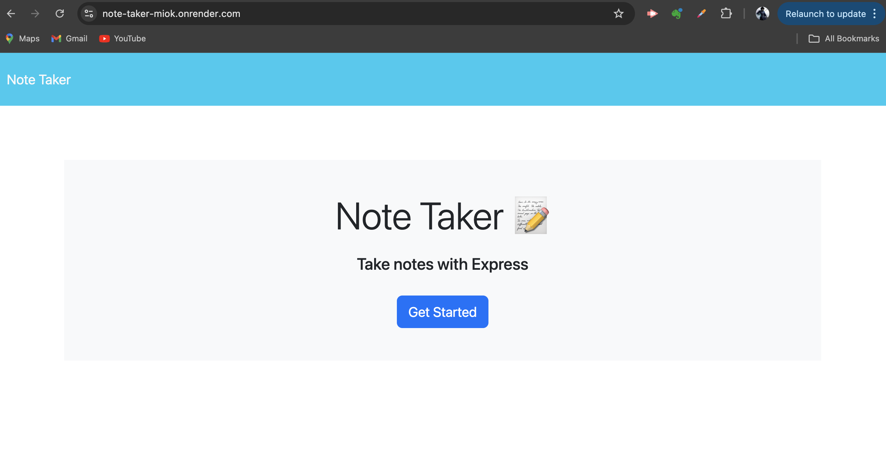
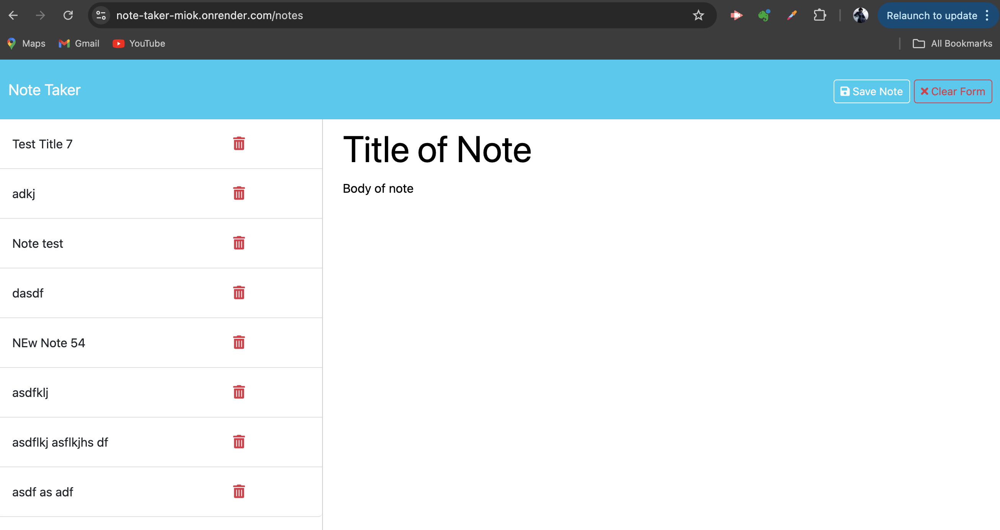

# Note-taker

For this assignment, I created the html and api routes to make the note taking pages work when deploying through Render.

The following images show the 2 pages of the web application:

## Link to Deployed Version
[Click here to see the deployed version](https://note-taker-miok.onrender.com/)

## Link to Github Repo
[Click here to see the Github Repo](https://github.com/JenGelfling/note-taker)